<p align="center">
  
</p>

<h1 align="center">SecondLook</h1>

<p align="center">
  <b>The pause before a bad decision.</b><br>
  Make the plan while you're sober. SecondLook keeps that promise at 2am.
</p>

<p align="center">
  <a href="https://secondlook1.vercel.app/"><b>Live app</b></a> ·
  <a href="https://www.youtube.com/watch?v=rpp4s6Ub9mg"><b>Demo video</b></a> ·
  <a href="#try-it-in-two-minutes"><b>Try it in 2 minutes</b></a> ·
  <a href="#run-it-on-your-computer"><b>Run it locally</b></a>
</p>

<p align="center">
  Built for <b>Beginner's Paradise: FirstCommit</b> on Devpost · Mobile web app (PWA) + Chrome/Edge extension · No signup · Works offline
</p>

<p align="center">
  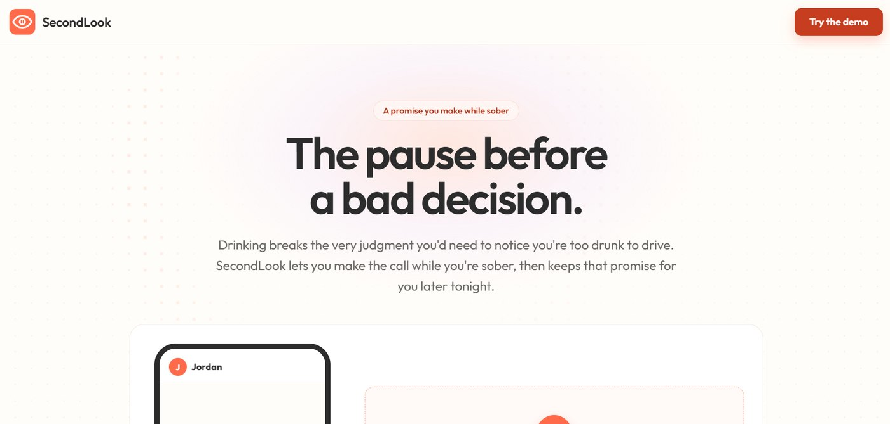
</p>

---

## Contents

- [The problem](#the-problem)
- [What SecondLook does](#what-secondlook-does)
- [Screenshots](#screenshots)
- [Demo video](#demo-video)
- [Try it in two minutes](#try-it-in-two-minutes)
- [Run it on your computer](#run-it-on-your-computer)
- [How it works](#how-it-works)
- [Tech stack](#tech-stack)
- [Testing](#testing)
- [Challenges I ran into](#challenges-i-ran-into)
- [What I learned](#what-i-learned)
- [Questions judges might ask](#questions-judges-might-ask)
- [Limitations and what's next](#limitations-and-whats-next)
- [Hackathon checklist](#hackathon-checklist)
- [How AI was used](#how-ai-was-used)

---

## The problem

In India in 2022, **4,201 people were killed** in crashes caused by drunk driving or drugs. That's 26.8% more than the year before, and about one death every two hours (Ministry of Road Transport and Highways, *Road Accidents in India 2022*, Table 3.1).

Nobody drives drunk because they think it's safe. They do it because alcohol damages the judgment they'd need to notice they're impaired, and feeling fine is one of the symptoms. So an app that says "you might be drunk" and leaves the choice to you is asking the one person who can't decide well tonight.

SecondLook moves the decision earlier. The sober you makes the plan in the afternoon, and the app keeps that promise later that night.

## What SecondLook does

**Who it's for:** people who drink socially and want a safety net they set up themselves, and the friends and family who'd rather get a message than a call from a hospital. It's built with India in mind (Uber, Ola and Rapido links, 112 as the emergency number, Hinglish in the typo checker), but the idea works anywhere.

| Step | What happens |
|---|---|
| **1. Set up while sober** | Pick a safe contact and decide what they'll hear. Take a 2-minute baseline: a reaction test, a steady-hand tracking test and a short typing test. |
| **2. Plan the night** | Start a Night Out: how you're getting home, when you'll be home, and a note to later-tonight you ("Don't drive, Alex. Seriously."). |
| **3. Get a second look** | When a message you type looks very different from your usual typing, SecondLook holds it and asks "Want a second look?". Your own plan comes first. You can edit it or send it anyway. It never blocks you. |
| **4. Check-in** | If you ignore the prompt, a check-in starts with a countdown. One tap opens the ride you planned, or you can call or text your contact, or prove you're fine with a 15-second test. |
| **5. Alert, only if you agreed** | If the countdown runs out, your contact gets an end-to-end encrypted alert on their phone. They can reply "I'm on my way", and you see it on your screen. |
| **6. Nothing hidden** | Every step goes into a plain-English log you can download. After anything is flagged, settings lock for 6 hours, so a drunk you can't switch off what the sober you decided. |

On a laptop, the browser extension adds the same second look to WhatsApp Web, Instagram DMs and Gmail.

## Screenshots

### The night: prompt, check-in, alert

<table>
  <tr>
    <td align="center">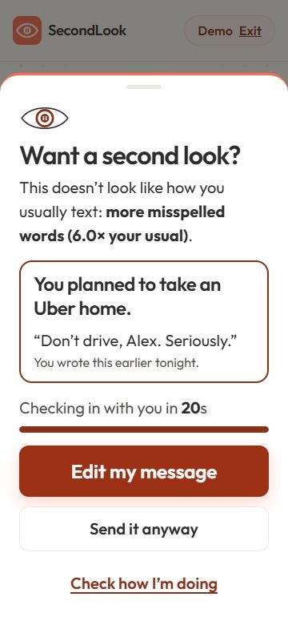<br><sub><b>The second look</b><br>Your plan first, one big button</sub></td>
    <td align="center">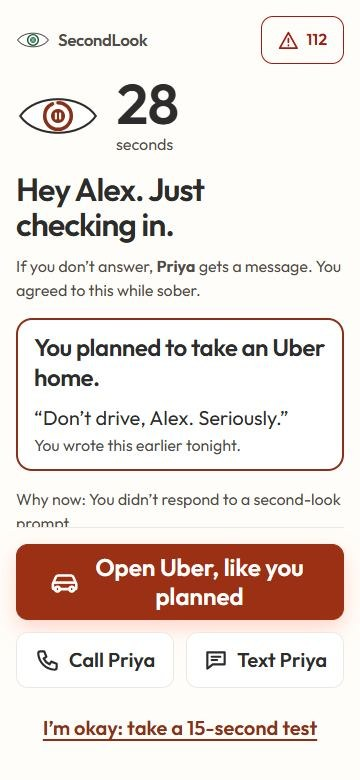<br><sub><b>Check-in</b><br>Your planned ride is one tap away</sub></td>
    <td align="center">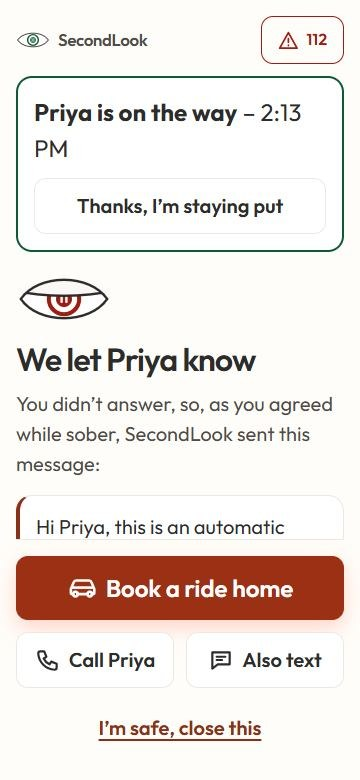<br><sub><b>Alert + reply</b><br>Priya is on the way</sub></td>
    <td align="center">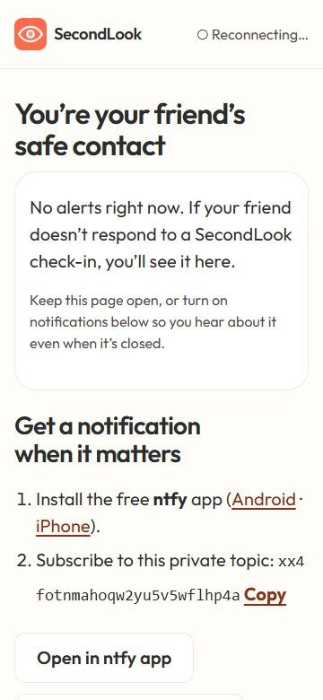<br><sub><b>Contact's view</b><br>What your safe contact sees</sub></td>
  </tr>
</table>

### The app

<table>
  <tr>
    <td>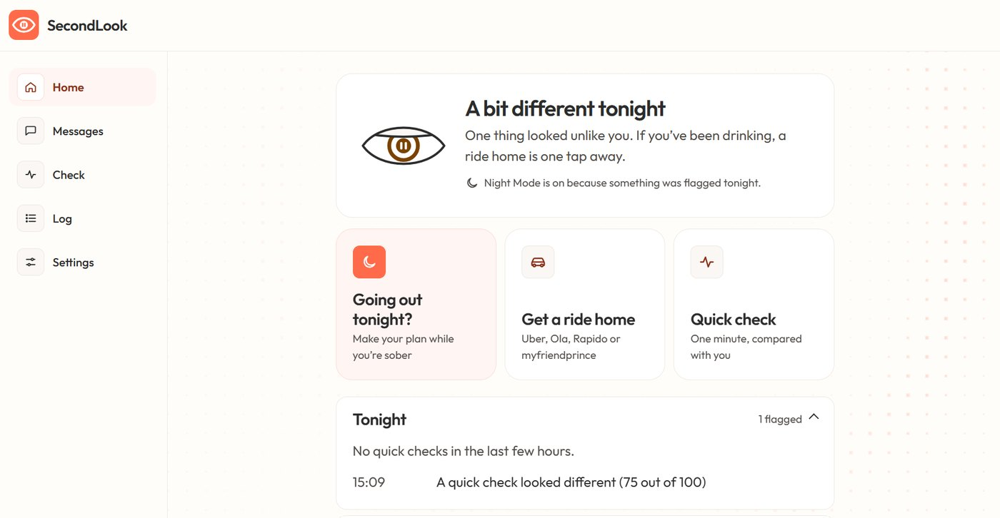<br><sub><b>Home.</b> The eye doubles as your status.</sub></td>
    <td>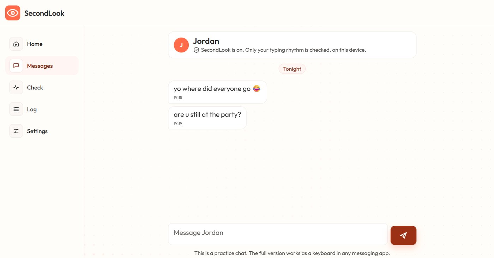<br><sub><b>Messages.</b> A practice chat that checks typing rhythm, never words.</sub></td>
  </tr>
  <tr>
    <td>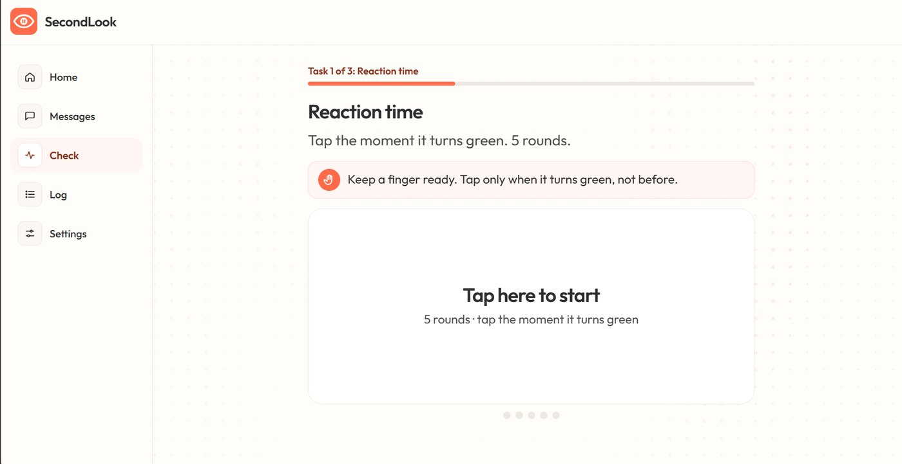<br><sub><b>Baseline.</b> Task 1 of 3: reaction time.</sub></td>
    <td>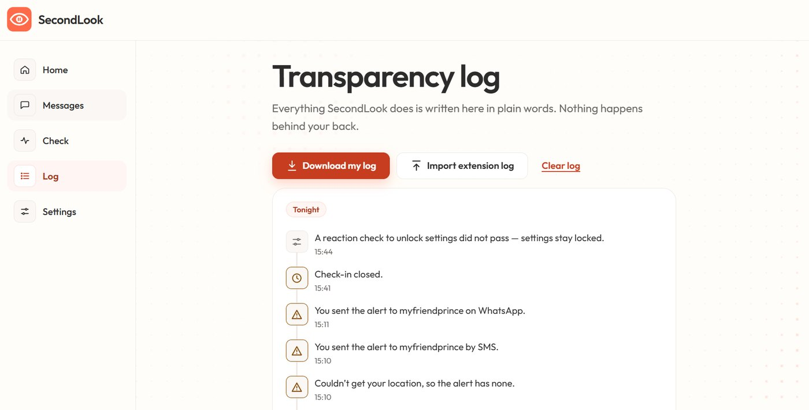<br><sub><b>Transparency log.</b> Every action in plain words.</sub></td>
  </tr>
  <tr>
    <td>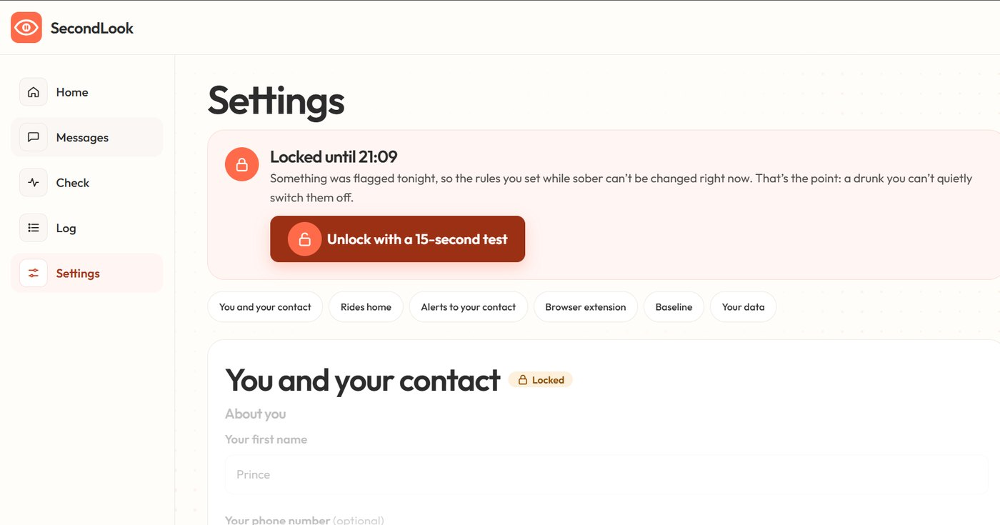<br><sub><b>Settings locked.</b> A drunk you can't undo the sober plan.</sub></td>
    <td>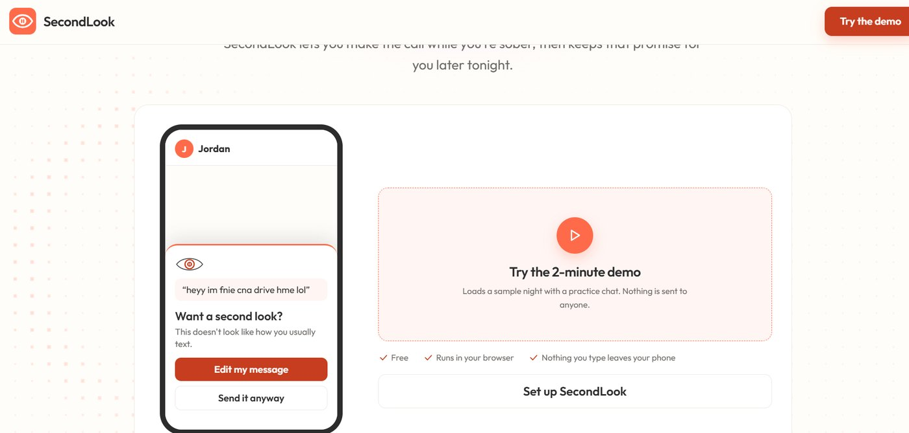<br><sub><b>Landing.</b> A live mini-demo and a one-click sample night.</sub></td>
  </tr>
  <tr>
    <td>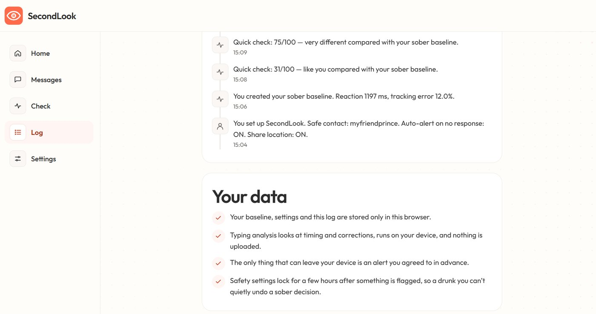<br><sub><b>Your data.</b> What's stored, and where.</sub></td>
    <td>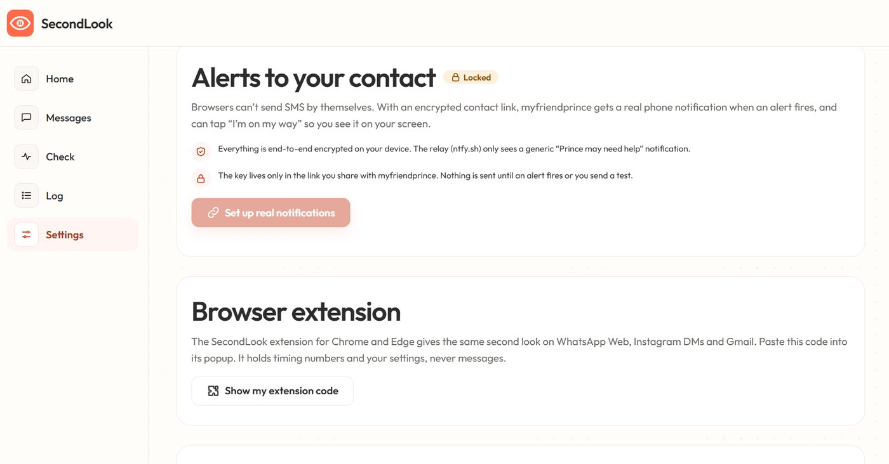<br><sub><b>Alerts and extension.</b> Encrypted contact link, and the code for the extension.</sub></td>
  </tr>
</table>

<details>
<summary><b>More of the landing page</b></summary>
<br>
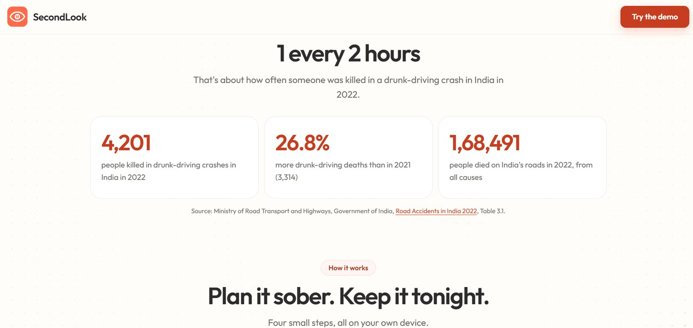
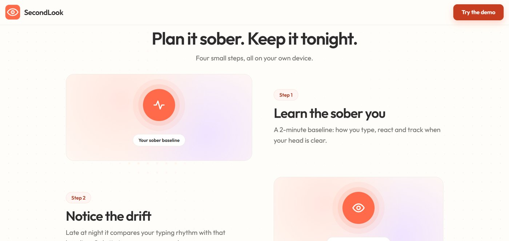
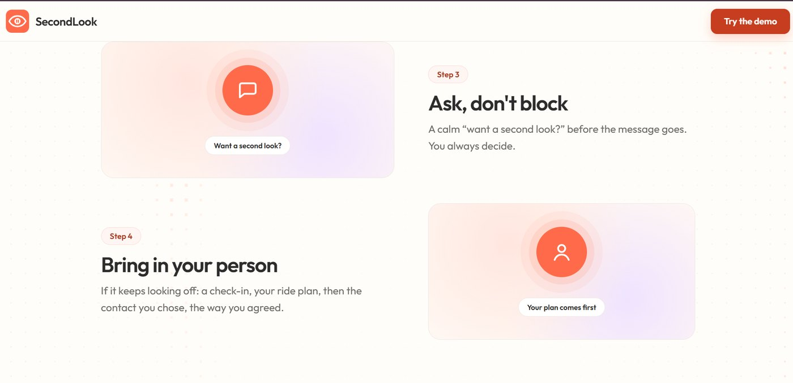
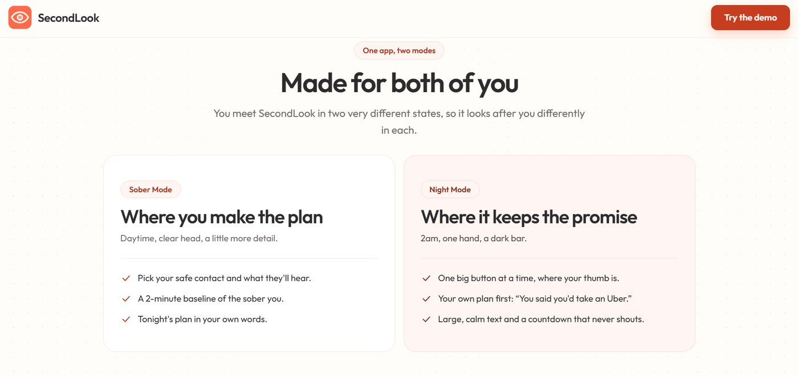
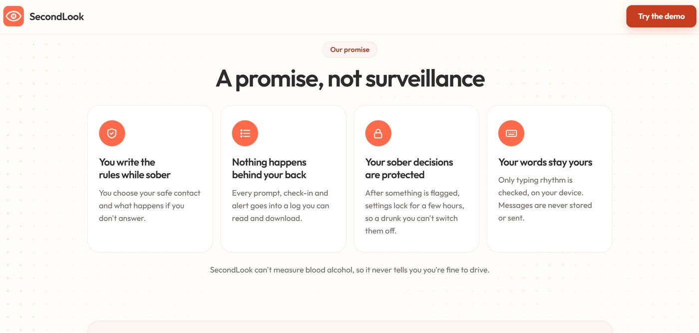
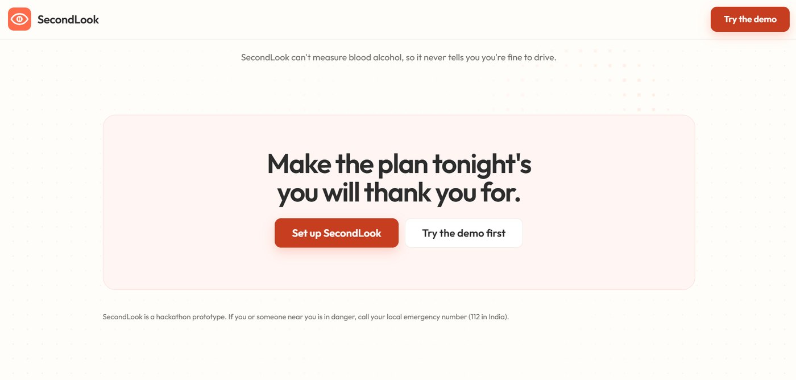
</details>

## Demo video

<p align="center">
  <a href="https://www.youtube.com/watch?v=rpp4s6Ub9mg">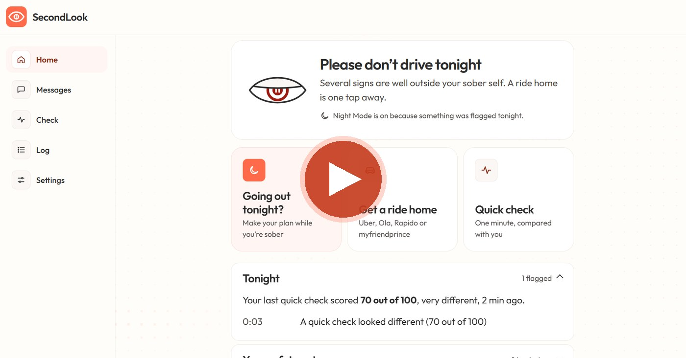</a><br>
  <a href="https://www.youtube.com/watch?v=rpp4s6Ub9mg"><b>▶ Watch the demo on YouTube</b></a>
</p>

It covers a live demo of the whole flow, how the scoring works, the technologies used, the challenges and what I learned.

## Try it in two minutes

Nothing to install.

1. Open **https://secondlook1.vercel.app/** and click **Try the 2-minute demo**. It loads a sample user (Alex), a safe contact (Priya) and a Night Out plan.
2. On the home screen, click **Open contact view** and put the two windows side by side. The second window is what Priya sees on her phone.
3. Go to **Messages** and tap **Simulate an impaired message**. The "Want a second look?" prompt appears.
4. Don't touch it. In the demo the prompt waits 20 seconds, then the check-in starts. After 30 more seconds the alert reaches the contact window.
5. In the contact window, tap **I'm on my way**. A banner appears on Alex's screen.
6. Open **Log** to see every step written down.

**On your phone:** open the link in Chrome, then menu → **Install app** (on iPhone, Safari → **Share → Add to Home Screen**). It opens full screen from its own icon and works offline.

To leave the demo, click **Exit** next to "Demo" at the top.

## Run it on your computer

You need [Node.js](https://nodejs.org/) 18 or newer. There are no packages to install.

```bash
git clone https://github.com/PrincePundir123/Drunk-drive.git
cd Drunk-drive
npm start      # opens the app at http://localhost:5173
npm test       # runs the 38 unit tests
```

Then open **http://localhost:5173** in Chrome or Edge.

You can also just double-click `index.html`. Everything works except offline mode and location sharing, because browsers only allow those on `localhost` or `https://`.

**Deploying your own copy:** import the repo into Vercel (framework preset **Other**, no build command) or turn on GitHub Pages (**Settings → Pages → main / root**). It's all static files.

### Install the browser extension (optional)

1. Open the web app and finish setup, or load the demo.
2. Go to **Settings → Browser extension**, click **Show my extension code** and copy it.
3. Open `chrome://extensions` (or `edge://extensions`), turn on **Developer mode**, click **Load unpacked** and choose the `extension/` folder.
4. Click the SecondLook icon, paste the code and press **Import**.
5. Reload any open WhatsApp Web, Instagram or Gmail tabs.

The code you paste holds your baseline numbers and settings, never anything you've typed.

## How it works

### 1. Your baseline and the score

The baseline records eight signals: reaction time, tracking error on a moving dot, time between keys, rhythm variability, corrections, long pauses, typos in the typing test, and misspelled words in messages. For each one it keeps a running average and spread (Welford's algorithm), so raw samples never need to be stored.

Every new reading becomes a z-score: how many of *your* usual spreads away from *your* usual you are right now.

```
z     = (now − your usual) / max(your usual spread, a percentage floor, a minimum floor)
score = 100 × (1 − e^(−(0.6 × weighted average of z + 0.4 × largest z) / 2))
```

- Only changes in the impaired direction count. Typing faster than usual never counts against you.
- The floors stop a short, very consistent baseline from turning small wobbles into alarms.
- 0–39 looks like you, 40–64 is a bit different, 65+ is very different.
- The prompt appears at 55 by default (45 on protective, 65 on gentle). A Night Out moves it one step more protective.
- The baseline keeps learning from normal messages, but never within 6 hours of a flag, so a drunk night can't become your new normal.

### 2. Privacy: typing is checked, words are not kept

The recorder keeps only timings and counts. When you press send, the text is read once, in memory, to count misspelled words against a built-in dictionary (about 2,500 everyday words plus texting slang and Hinglish). Then it's gone. Nothing you type is saved or sent.

Your profile, baseline, plan and log live in your own browser. There's no server and no account.

### 3. Alerts and encryption

```
 your phone                                               contact's phone
 ┌────────────────────────────┐                         ┌──────────────────────┐
 │ SecondLook web app         │  "Alex may need help"   │ ntfy app             │
 │  encrypts the alert with   │ ──────────────────────▶ │  (notification only) │
 │  AES-GCM (Web Crypto)      │                         └─────────┬────────────┘
 │                            │  encrypted   ┌─────────┐          │ opens
 │                            │ ───────────▶ │ ntfy.sh │ ───────▶ ▼
 │                            │ ◀─────────── │  relay  │ ◀─────── contact.html
 └────────────────────────────┘  encrypted   └─────────┘   decrypts, replies
```

Creating a contact link makes two random topic names and a 256-bit AES-GCM key. The link looks like `contact.html?a=<alertTopic>&r=<replyTopic>#k=<key>`. Browsers never send the part after `#` to a server, so the key only exists on your phone and your contact's phone. The relay, [ntfy.sh](https://ntfy.sh), only sees scrambled data and a generic "may need help" notification with your first name. Replies come back the same way.

### 4. The browser extension

The extension (Manifest V3) catches Enter and the send button on WhatsApp Web, Instagram DMs and Gmail with capture-phase listeners, so it sees the key press before the site does. The prompt lives in a closed Shadow DOM so the site can't restyle or read it. **Send anyway** clicks the site's own send button. And it fails open: if anything inside the extension breaks, your message sends normally.

## Tech stack

| Technology | Why I used it |
|---|---|
| HTML, CSS, JavaScript (no framework) | Small, fast on cheap phones, runs from one `index.html` with no build step |
| PWA (manifest + service worker) | Installs from a link, opens full screen, works offline |
| Web Crypto API (AES-GCM) | End-to-end encrypted alerts without a backend |
| [ntfy.sh](https://ntfy.sh) | Free, open-source push notifications and the encrypted relay |
| Chrome/Edge extension (Manifest V3, Shadow DOM) | The second look on real chat sites |
| localStorage / chrome.storage | All data stays on your own device |
| Canvas | The tracking test and the animated dot background |
| Node.js `node:test` | 38 unit tests and a tiny dev server, no dependencies |
| Playwright, axe-core, Lighthouse | End-to-end tests, accessibility and performance checks |
| Vercel | Hosting the live version |
| Outfit + Atkinson Hyperlegible fonts | Self-hosted (SIL Open Font License), nothing from a CDN |

The app loads no third-party JavaScript. Even the QR code for sharing the contact link is drawn by a small encoder written for this project (`js/qr.js`).

## Design

The same person meets SecondLook in two states, so there are two modes in one warm, light style.

**Sober Mode** (setup, dashboard, log, settings) can show more detail, because you're thinking clearly.

**Night Mode** (the prompt, check-in, alert, reminders, contact page) assumes it's 2am, you're in a dark bar with one hand free, maybe drunk. So each screen has one main action at the bottom where your thumb is (64px tall), 20px body text, 32px key text, and colours at WCAG AAA contrast (7:1 or better). It shows your own words first, and the main button says exactly what it does: "Open Uber, like you planned". Nothing flashes red at you.

The logo is an eye with a pause in the pupil. It's also the status display: the lid lowers when things look less like you, and the iris drains as the check-in counts down.

## Testing

| Check | Result |
|---|---|
| Unit tests (`npm test`) | 38 passing: scoring, keystroke analysis, dictionary, encryption, contact links, QR encoder, extension codes, Night Out, ride links |
| End-to-end (Playwright, Microsoft Edge) | 7 suites, 167 checks passing, including two browsers talking through the real ntfy relay and the real extension |
| Accessibility (axe-core) | 0 violations on 24 screen states, phone and desktop |
| Lighthouse (mobile) | Main page: performance 99, accessibility 100, best practices 100, SEO 100 |
| Keyboard and zoom | Works keyboard-only with a visible focus ring; no sideways scroll at 320px or 200% zoom |
| Screen readers | Countdowns announced at 30, 10 and 5 seconds |

The end-to-end suites live outside the repo because they need Playwright installed.

**Not proven yet:** there's a validation study page (`study.html`) that measures false alarms using safe stand-ins for impairment, like typing with your other hand. I haven't run it with enough people to report numbers, and I'd rather say that than show made-up ones.

## Challenges I ran into

- **Designing for someone who's drunk.** Normal UI assumes a focused user. I had to design for someone who can't read small text, taps the wrong thing, and might be annoyed at being asked. That's where one-action screens, big buttons and "ask, don't block" came from.
- **Checking typing without keeping the words.** My first version stored words to count typos, which meant storing bits of private messages. I rebuilt it so only timings and counts are kept.
- **Not breaking other people's websites.** Catching Enter before WhatsApp does, without ever losing a message, needed a strict rule: if anything fails, just send.
- **Encryption without a server.** Putting the key after the `#` in the link let the contact get alerts that no server of mine could read.
- **Performance.** An animated background dropped Lighthouse performance to 94 and blocked the page for 210 ms. Drawing the still grid once and redrawing only the moving ripple brought it back to 99, with no blocking.
- **Colour contrast.** My coral button colour failed contrast with white text (2.8:1). I kept it for decoration and used a deeper coral for buttons and text.
- **Two copies of the scoring code.** The app and the extension share it, so I wrote a script that copies it into the extension (`npm run build:ext`) and a test that fails if the copies drift apart.

## What I learned

- How to turn "does this person seem off?" into numbers with z-scores and running averages, and why floors matter when you have little data.
- How end-to-end encryption works in the browser, and how to share a key without a server.
- How browser extensions work: content scripts, capture-phase events, Shadow DOM, Manifest V3.
- How service workers let a website install and work offline like an app.
- That accessibility is something you measure with axe, Lighthouse and a keyboard, not something you guess.
- That for a safety tool, being honest earns more trust than big claims. SecondLook never says "you're safe to drive", because it can't know that.

## Questions judges might ask

<details>
<summary><b>Can SecondLook tell if I'm drunk?</b></summary>
<br>
No, and it never claims to. It can't measure blood alcohol. It notices when you're behaving unlike your sober self: slower, less steady, more mistakes. Tiredness or stress can look similar, which is exactly why it asks instead of blocking. It will never tell you you're fine to drive.
</details>

<details>
<summary><b>Why typing, and not a breathalyzer or the camera?</b></summary>
<br>
People already type at night, so it needs no extra hardware and no new habit. Breathalyzers cost money and nobody carries one. A camera feels like surveillance.
</details>

<details>
<summary><b>Won't a 2-minute baseline cause lots of false alarms?</b></summary>
<br>
That's the main risk, so there are three protections: floors in the formula, only the impaired direction counts, and the baseline keeps learning from normal messages. A false alarm costs one tap on "Send it anyway", and sensitivity can be changed in settings.
</details>

<details>
<summary><b>Does it read my messages?</b></summary>
<br>
No. It keeps key timings and counts. At send time it reads the text once, in memory, only to count misspelled words, then discards it. Nothing you type is saved or sent.
</details>

<details>
<summary><b>Why is there no login?</b></summary>
<br>
On purpose. All your data stays on your phone, so there's nothing to log in to. Your contact gets a private encrypted link instead of an account. The trade-off: clearing browser data removes your setup (you can download your log first).
</details>

<details>
<summary><b>Why a web app and not an Android app?</b></summary>
<br>
It installs from a link on both Android and iPhone, works offline, and anyone can try it in seconds. Once installed it behaves like an app. The long-term version would be a phone keyboard, since that's where people actually type at night.
</details>

<details>
<summary><b>What stops me from just turning it off when I'm drunk?</b></summary>
<br>
After anything is flagged, settings, pausing the extension and replacing the baseline all lock for 6 hours. You can unlock early by passing the 15-second reaction test. Clearing browser data still works. The lock slows you down; it doesn't trap you.
</details>

<details>
<summary><b>Could someone use this to spy on a partner?</b></summary>
<br>
It's built so that doesn't work. Everything runs on the user's own device and there's no dashboard for anyone else. The contact gets nothing until an alert fires, and alerts only fire under rules the user chose. Even then they get a short notice and a general reason, never messages or typing data. Location is only shared if the user ticked that box, and everything is visible to the user in the log.
</details>

<details>
<summary><b>What is ntfy, and is it safe?</b></summary>
<br>
ntfy.sh is a free, open-source push notification service. SecondLook only ever sends it encrypted data and a generic "may need help" message. Without the key, it can't read the reason, the location or the replies.
</details>

<details>
<summary><b>Did you test the extension on the real WhatsApp?</b></summary>
<br>
The automated tests run the real extension on test pages served at the WhatsApp Web and Gmail addresses, because automated tests can't log in to real accounts. All site-specific selectors live in one file (<code>extension/src/selectors.js</code>) with fallbacks, because big sites change their pages without warning.
</details>

<details>
<summary><b>Why no React or other framework?</b></summary>
<br>
The app is small, and I wanted it to load fast on low-end phones and run straight from <code>index.html</code> without a build step. Plain JavaScript also meant I had to understand every part of it.
</details>

## Limitations and what's next

**Limitations**
- These are behavioural signals, not a breathalyzer. Tiredness, stress or a new keyboard can look similar.
- Browsers can't send SMS on their own. Without the contact link, the alert opens your SMS app with the message ready.
- Phones slow down timers in background tabs, so in-app Night Out reminders can arrive late.
- The typo check only understands English and Hinglish.
- No accuracy numbers yet (see Testing).

**What's next:** a real phone keyboard for Android and iOS, steadiness readings from the phone's motion sensors, SMS alerts for contacts without ntfy, one-tap booking through ride-app APIs, Hindi and other Indian languages in the typo check, and running the validation study with real people.

## Hackathon checklist

| FirstCommit requirement | Where to find it |
|---|---|
| Working project | [secondlook1.vercel.app](https://secondlook1.vercel.app/) |
| Public GitHub repository | This repo |
| What it is, the problem, who it's for | [The problem](#the-problem), [What SecondLook does](#what-secondlook-does) |
| Demo video (3–5 min) | [YouTube](https://www.youtube.com/watch?v=rpp4s6Ub9mg) |
| Setup instructions | [Try it in two minutes](#try-it-in-two-minutes), [Run it on your computer](#run-it-on-your-computer) |
| Technologies used | [Tech stack](#tech-stack) |
| Challenges and what I learned | [Challenges](#challenges-i-ran-into), [What I learned](#what-i-learned) |
| Screenshots | [Screenshots](#screenshots) |
| AI disclosure | [How AI was used](#how-ai-was-used) |

## How AI was used

The rules ask for this, so here it is plainly. I built SecondLook with a lot of help from Claude Code, an AI coding assistant made by Anthropic. I came up with the idea and the problem, wrote the requirements (including the privacy rules: no message text stored, no backend, consent before any alert), chose the design direction and the Indian data source, and tested and deployed the app. A large part of the code, the tests and the documentation was written by the AI from my instructions, and I worked with it step by step: asking questions, asking for changes and checking the results in the browser.

<details>
<summary><b>Project structure</b></summary>

```
index.html                   landing page and app shell
css/tokens.css               colours, type and spacing for Sober Mode and Night Mode
css/style.css                all components (uses only the tokens)
js/app.js                    screens, prompt, check-in, alerts, Night Out, log, settings, demo
js/metrics.js                scoring (pure functions, also used by the tests)
js/tests.js                  reaction, tracking and typing tasks; keystroke recorder
js/words.js                  dictionary (~2,500 words, texting slang, Hinglish)
js/rides.js                  ride, call, message and 112 links
js/secure.js, js/relay.js    AES-GCM encryption; ntfy publish and subscribe
js/qr.js                     QR code encoder for the contact link
js/nightout.js               Night Out logic
js/share.js                  moving the baseline and log between app and extension
js/sonar.js                  the animated dot background
contact.html, js/contact.js  the safe contact's page
study.html, js/study.js      validation study page (stand-ins, no alcohol)
extension/                   Chrome/Edge extension (Manifest V3)
scripts/                     dev server, extension sync, icon maker, study analysis
tests/                       unit tests (node:test)
docs/                        design notes, screenshots
assets/                      icons and self-hosted fonts
```
</details>

## Credits and license

- Road accident data: Ministry of Road Transport and Highways, Government of India, [Road Accidents in India 2022](https://morth.gov.in/backend/documents/uploaded/1755600426_RA_2022_30_Oct.pdf).
- Fonts: [Outfit](https://github.com/Outfitio/Outfit-Fonts) and [Atkinson Hyperlegible](https://www.brailleinstitute.org/freefont/) (Braille Institute), SIL Open Font License. License files are in `assets/fonts/`.
- Notifications: [ntfy.sh](https://ntfy.sh).

Released under the [MIT License](LICENSE).
